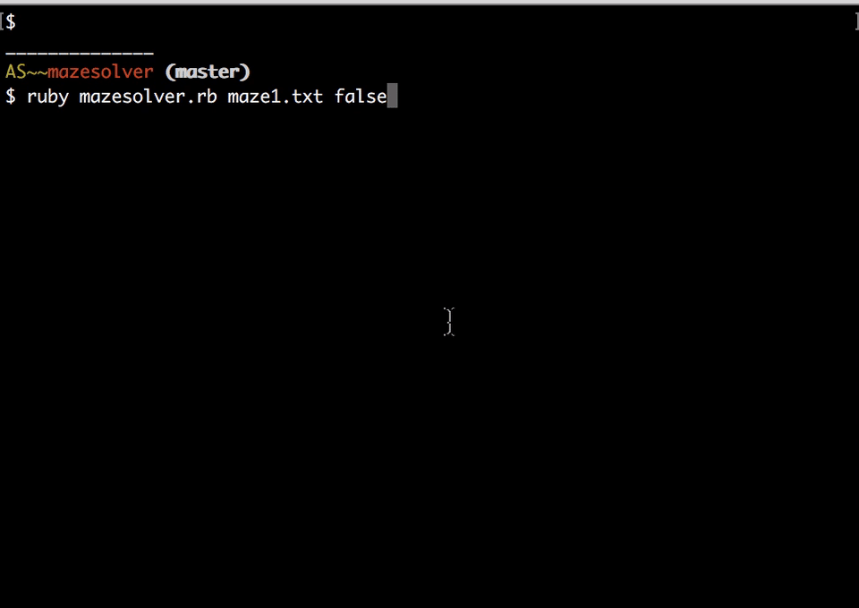

# Maze Solver

Maze Solver written in Ruby implemented by using Breadth-first-search (BFS) and Depth-first-search (DFS) algorithms.

## How to use

The solver loads the maze from a text file. Refer to the included maze text files for examples. To solve a maze, run `ruby mazesolver.rb FILENAME`. For example `ruby mazesolver.rb maze1.txt` will solve the maze1.txt file. You may specify if you would like to use BFS or DFS by passing a boolean at the end of the code. `true` will solve the maze using DFS and `false` will solve the maze using BFS.
Example: `ruby mazesolver.rb maze1.txt true` will solve maze1 using DFS

